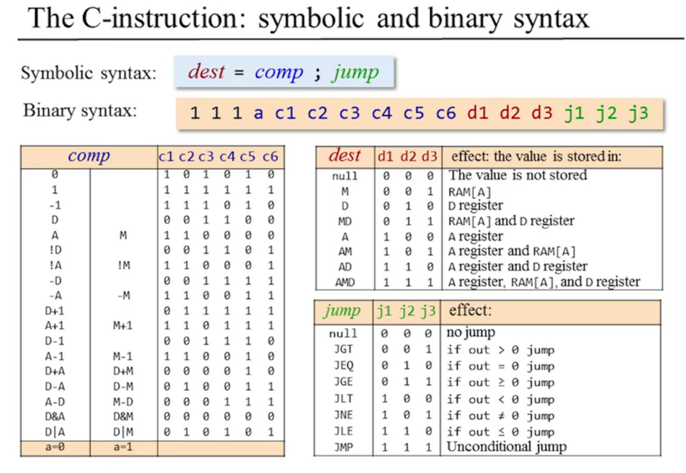

# Unit 4.2: Machine Language: Elements

- Machine language is the most important interface in the world.
- Machine language specifies exactly what the hardware can do for us. 

Cost-performane tradeoff:
- The more sophisticated operations and types the more expensive the
hardware gets

## Machine Operations

- Flow control operation: when to jump inside a program
- Different machine langugages differ on what they offer.
- What data types can our hardware access? 8-bit vs. 64-bit numbers.
- Some machine languages can also support floating point operations.

## Addressing

How do we decide what data to work on? How does the hardware allows us
to do this?

- Accessing memory is an expensive operations in two ways:
  - Need to specify a long address
  - Gettings memory contents into the CPU takes a long time compares to the CPU
    operations

Solution: Memory Hierarchy.
Insert drawing

Memory Hierachy
- Registers
- Cache
- Main memory
- Disk

1. Registers
- All CPU contains few registers inside
- Getting information from them is extremely quickly
- Quick to address
- Central part of the machine language

Example: ```Add R1, R2```

Address register: ```Store R1, @A```

Addressing Modes: 

How dow we decide which data to work upon? 

How to tell the CPU on which data to apply an operation say the add operation?

1. Register -> ```Add R1,R2```

1. Direct -> ```Add R1, M[200]```

1. Indirect -> ```Add R1, index```

1. Immediate -> ```Add 73, R1```

## Input/Output

- Many types of input and output
  Keyboard, mouse, camera, sensors...

CPU needs some protocol to talk to them -> drivers knows these protocols

One general methods to do this: memory mapping

Connect the registers that control the devices as a part of the memory.
Gives us access to input/output as if we were accesing the memory itself.

## Flow control
How can we tell the hardware which instrution to execute next?

- Unconditional jumps: for loop
- Conditional jumps: if statement

## Hack Language Specification

There are two ways to express the same semantics:

- Symbolic and/or binary
- Need to convert symbolic language -> binary. Assembler!

### The A-instruction: symbolic and binary syntax.

Symbolic syntax:

Binary syntax:
For an A-Instruction looks like this _0-**value**_: 
  
  - Zero tell the computer this is an A-instruction
  - The initial zero is called the op-code or operation code.

### The C-Instruction: symbolic and binary syntax:
    dest= comp ; jump

```
1 1 1 a c1 c2 c3 c4 c5 c6 d1 d2 d3 j1 j2 j3
```

Binary Syntax: 
- First bit: 1 is the C-instruction op-code
- Bits 2 and 3 are not used.
- Next seven bits: computation I want to achieve
- Next three bits: represent the destination
Last three bits: represent the jump condition.



## Input/Output

Peripheral I/O devices
- Keyboard and screen.
- Used to comunicate with the user. Get and display data to user.

High level approach -> libraries

Low level approach -> bits

### Hack Computer: Output

- A dedicated, designated region to display the screen: Screen memory map
- The physical display is continously refreshed from the memory map
- Output is effected by writing code that manipulates the screen memory map


## Input: Keyboard Memory Map

The physical keyboard is associated with a keyboard memory map. 

When a key is pressed on the keyboard, the key's scan conde appeas in the keyboard memory map.

In the Hack computer: probe the contents of RAM[24576]


## Hack Assembly Instructions

*A-Instruction* - "Address" instruction

`@value` // A = value - where value is either a constant or a symbol referring to such constant

*C-Instruction* - "Compute" instruction

 - dest = comp; jump -> both dest and jump are optional

 - comp: `0, 1, -1, ... D+A, D-A, A-D ...`
 - dest: `null, M, D, ..., AD, AMD`
 - jump: `null, JGT, JEQ, JGE...`

Before we can exectute anything, these symbols needs to be translated to binary code.

Working with registers and memory: the bread and butter of low-level programming

1. D: data register
1. A: address/data register
1. M: the currently selected memory register -> M = RAM[A]

#### A Hack program example: Add two numbers

// Program: Add2.asm
// Computes: RAM[2] = RAM[0] + RAM[1]
// Usage: put values in RAM[0], RAM[1]

How to terminate a program properly?
- Add infinite loop
#### Build-in Symbols

Symbols: R0-R12 value 0-12

SCREEN - 16384
KBD - 24576


